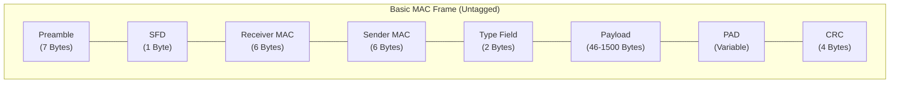
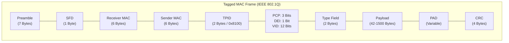

# Ethernet-Frame

## My Understanding

* **Basic functions**: 
The IEEE defines various Ethernet frame formats, with the Ethernet II frame—supporting VLAN extensions—being the standard widely used in the automotive industry. The Ethernet II frame distinguishes between a basic MAC frame (untagged) and a tagged MAC frame (with a VLAN Tag).

* **Ether type**: 
These two frame types are differentiated by the EtherType field. In a basic MAC frame, the EtherType specifies the higher-layer protocol (e.g., IPv4) used in the payload. However, when the initial EtherType field is set to 0x8100, it indicates the presence of a VLAN Tag. In this case, a 4-byte VLAN Tag is inserted into the original EtherType position, and the original EtherType field is shifted backward by 4 bytes.

* **VLAN tag**: 
A VLAN Tag consists of a Tag Protocol Identifier (TPID) and Tag Control Information (TCI):

  * TPID: Occupies 2 bytes and is set to 0x8100 to identify the frame as an 802.1Q tagged frame.
  * TCI: Occupies 2 bytes and is further divided into a Priority Code Point (PCP), a Drop Eligible Indicator / Canonical Form Indicator (DEI/CFI), and a VLAN Identifier (VID).

* **Payload**: 
Following the shifted EtherType field is the Payload data area. It has a minimum length of 46 bytes (or 42 bytes when a VLAN tag is present) and a maximum length of 1500 bytes in standard automotive applications.

* **CRC checksum**: 
A CRC Checksum is appended at the end of the Ethernet II frame. It is calculated using a standardized algorithm that is implemented identically on both the sender and receiver. The calculation covers all fields of the Ethernet II frame to ensure end-to-end data integrity.

* **Ethernet packet**: 
For physical transmission, the Ethernet controller prepends a Preamble and a Start Frame Delimiter (SFD) to signal the beginning of a frame. The combination of the Preamble, SFD, and the Ethernet II frame itself is collectively referred to as an Ethernet Packet.

## Questions

### Q1: Regarding the EtherType field: if a frame logically fits multiple protocol types, can it contain multiple EtherType values simultaneously? If not, what strategy or mechanism is used to determine or stack the correct EtherType?

**Answer:**

Short answer: **No, a single Ethernet header contains only one 2-byte EtherType field. However, protocol stacking (encapsulation) allows multiple EtherType fields to be chained sequentially inside nested headers.**

Here is a detailed breakdown of how Ethernet handles multi-protocol scenarios and protocol selection:

#### 1. Frame Structure Constraint: One EtherType per Header
An Ethernet II header has a fixed 2-byte EtherType field. It functions specifically to identify the **immediate next-layer protocol** or header that follows. Therefore, a single MAC header cannot carry multiple EtherType values side-by-side.

#### 2. Protocol Stacking (Layered EtherType Chaining)
When traffic involves multiple encapsulation layers (e.g., VLAN tagging, QinQ, or IPv4/IPv6 over Ethernet), Ethernet handles this by **nesting headers sequentially**. Each header carries its own EtherType pointing to the subsequent layer:

* **VLAN Tagging (IEEE 802.1Q):**
  * MAC Header EtherType = `0x8100` (Indicates IEEE 802.1Q Tag follows)
  * Inner Tag EtherType = `0x0800` (Indicates IPv4 Payload follows)
* **Double VLAN Tagging (QinQ / IEEE 802.1ad):**
  * Outer Tag EtherType = `0x88A8` (Service Tag / S-TAG)
  * Inner Tag EtherType = `0x8100` (Customer Tag / C-TAG)
  * Next EtherType = `0x0800` (Payload Protocol)

In this approach, protocols are processed layer-by-layer rather than simultaneously at the MAC layer.

#### 3. Selection Strategy: How to Determine the Primary EtherType
If a data payload could theoretically be classified under different protocol wrappers, network designers select the EtherType based on the following hierarchy:

1. **Innermost Upper-Layer Protocol:** The EtherType must explicitly identify the payload parser (e.g., `0x0800` for IPv4, `0x86DD` for IPv6, `0x88F7` for IEEE 1588 PTP, or `0x22F0` for TSN AVTP).
2. **Encapsulation Middleware (Tunneling):** If higher-layer data needs to be wrapped (such as SOME/IP or DoIP over UDP/IP), the EtherType remains set to IPv4 (`0x0800`) or IPv6 (`0x86DD`). Protocol distinction is then handled by the L4 UDP/TCP port number rather than the Ethernet layer.
3. **IEEE Registration Authority Standards:** Always use standardized EtherType values assigned by IEEE to ensure inter-operability between different suppliers' ECUs and Ethernet switches.

#### Summary
Ethernet MAC headers do not support multiple side-by-side EtherTypes. Instead, complex multi-protocol structures use **sequential header stacking** (e.g., VLAN tags) or delegate protocol identification to **higher layers (L3/L4/L7)**.

### Q2: What is the exact range of fields over which the Ethernet CRC checksum (Frame Check Sequence / FCS) is calculated?

**Answer:**

In Ethernet II standards (IEEE 802.3), the **Cyclic Redundancy Check (CRC-32)**—also referred to as the **Frame Check Sequence (FCS)**—is calculated across the entire Layer 2 MAC frame structure, excluding physical layer sync symbols and the CRC field itself.

Below is the precise field breakdown:

#### 1. Included Fields (Covered by CRC Calculation)
The CRC checksum is calculated over all contiguous bytes starting from the **Destination MAC Address** through to the end of the **Payload / PAD**:

* **Destination MAC Address** (6 bytes)
* **Source MAC Address** (6 bytes)
* **VLAN Tag / TCI Fields** (4 bytes, if present in 802.1Q frames)
* **EtherType / Length Field** (2 bytes)
* **MAC Client Payload Data** (46–1500 bytes for basic frames, 42–1500 bytes for tagged frames)
* **Padding (PAD)** (variable bytes, added if payload is below the minimum frame size requirement)

#### 2. Excluded Fields (Not Covered by CRC Calculation)
The following fields are explicitly **excluded** from the CRC calculation:

* **Preamble (7 bytes) & Start Frame Delimiter / SFD (1 byte):** These are Physical Layer (L1) synchronization patterns added by the Ethernet Controller / PHY and are stripped prior to Layer 2 processing.
* **Interframe Gap / IFG (minimum 12 bytes):** Physical layer idle time between packet transmissions.
* **CRC / FCS Field Itself (4 bytes):** The 32-bit checksum value is appended directly after the calculation is complete.

#### 3. Calculation Mechanism & Hardware Implementation
* **Algorithm:** Ethernet uses the standard **CRC-32 (IEEE 802.3 polynomial)**:
  $$G(x) = x^{32} + x^{26} + x^{23} + x^{22} + x^{16} + x^{12} + x^{11} + x^{10} + x^8 + x^7 + x^5 + x^4 + x^2 + x + 1$$
* **Hardware Offloading:** In modern microcontrollers and Ethernet controllers, the CRC calculation and verification are performed entirely in hardware by the MAC IP block in real time as bits pass through the Media Independent Interface (MII/RMII/RGMII).
* **Error Handling:** If the receiver calculates a CRC value that does not match the 4-byte FCS appended at the end of the frame, the frame is silently dropped at Layer 2 to prevent corrupted data from propagating to higher protocol layers.

#### Summary
The Ethernet CRC checksum covers **Destination MAC + Source MAC + [VLAN Tag] + EtherType + Payload + PAD**. It guarantees data integrity for all MAC header and payload fields without including physical layer synchronization preamble bytes.

### Q3: What is the difference between the Preamble and the Start Frame Delimiter (SFD)? Why are both needed instead of just using a single field?

**Answer:**

In Ethernet physical layer communication, both the **Preamble** and the **Start Frame Delimiter (SFD)** serve as bit-level synchronization signals before the actual Layer 2 Ethernet frame begins. While they appear sequentially at the start of an Ethernet packet, they perform distinct, complementary roles in hardware synchronization.

Below is a detailed breakdown of their differences and why both fields are required:

#### 1. Functional Differences

| Feature | Preamble | Start Frame Delimiter (SFD) |
| :--- | :--- | :--- |
| **Length** | 7 Bytes (56 bits) | 1 Byte (8 bits) |
| **Bit Pattern** | Repeating `10101010` sequence | `10101011` sequence |
| **Primary Role** | Clock & Phase Synchronization | Frame Alignment Indicator |
| **Layer Level** | Physical Layer (PHY) receiver training | Boundary signal separating L1 preamble from L2 MAC header |

#### 2. Detailed Mechanism: Why One Is Not Enough

##### **Step 1: Preamble — Establishing Bit-Level Clock Sync**
* When an Ethernet transmitter is idle, no bit clock is being recovered by the receiving PHY.
* Upon packet transmission, the receiver's Phase-Locked Loop (PLL) requires time to lock onto the incoming signal's frequency and phase.
* The 7-byte repeating `10101010` pattern creates a continuous, predictable square wave. This allows the receiving Ethernet PHY hardware to stabilize its internal clock and reliably sample subsequent incoming bits.

##### **Step 2: SFD — Signaling the Exact Start of the MAC Frame**
* During clock synchronization, the receiving PHY may miss or corrupt the first few bits of the Preamble while its PLL is stabilizing. Consequently, the receiver cannot rely on counting the exact number of preamble bits to know when the header starts.
* The SFD ends with two consecutive `1` bits (`...1011`).
* This pattern break acts as a unique hardware trigger: as soon as the MAC/PHY controller detects the ending `11` bit sequence, it immediately knows that the very next bit is the first bit of the **Destination MAC Address**.

#### 3. Why Not Combine or Use Only One?
* **Why not Preamble only?** Without an explicit SFD marker, any bit jitter or lost bits during initial clock lock-in would shift the byte alignment, causing the entire MAC frame (MAC address, EtherType, payload) to be misaligned and corrupted.
* **Why not SFD only?** Without a sufficiently long preamble beforehand, the receiver's physical layer circuitry would not have enough time to lock its clock, resulting in failure to detect the SFD pattern altogether.

#### Summary
* **Preamble (`10101010...`):** Wakes up and synchronizes the receiver's hardware clock (PLL).
* **SFD (`10101011`):** Signals the exact boundary where physical layer clock training ends and actual Layer 2 frame data begins.

### Q4: What are the components of an IEEE 802.1Q VLAN Tag, and what is the exact bit/byte length of each field?

**Answer:**

In Ethernet architectures, an **IEEE 802.1Q VLAN Tag** is a 4-byte (32-bit) field inserted into the Ethernet frame between the Source MAC Address and the original EtherType field. It consists of two main sections: the **Tag Protocol Identifier (TPID)** and the **Tag Control Information (TCI)**.

Below is the detailed breakdown of each component and its corresponding length:

#### 1. VLAN Tag Field Breakdown

| Component | Full Name | Length | Value / Purpose |
| :--- | :--- | :--- | :--- |
| **TPID** | Tag Protocol Identifier | **2 Bytes** (16 Bits) | Fixed value `0x8100` (identifies the frame as an 802.1Q tagged frame) |
| **TCI** | Tag Control Information | **2 Bytes** (16 Bits) | Subdivided into PCP, DEI/CFI, and VID (see details below) |

---

#### 2. Sub-fields of Tag Control Information (TCI)

The 16-bit TCI field is further divided into three distinct functional fields:

##### **A. Priority Code Point (PCP)**
* **Length:** **3 Bits**
* **Function:** Defines Quality of Service (QoS) and traffic prioritization at Layer 2.
* **Range:** $2^3 = 8$ priority levels (from `0` for lowest/best-effort traffic up to `7` for critical control signals).

##### **B. Drop Eligible Indicator / Canonical Form Indicator (DEI / CFI)**
* **Length:** **1 Bit**
* **Function:** 
  * In modern 802.1Q standards, it serves as the **Drop Eligible Indicator (DEI)**, marking frames that may be dropped first during network congestion.
  * Historically in legacy token-ring networks, it served as the **Canonical Form Indicator (CFI)** to indicate MAC address bit order.

##### **C. VLAN Identifier (VID)**
* **Length:** **12 Bits**
* **Function:** Uniquely identifies the specific Virtual LAN to which the frame belongs.
* **Range:** $2^{12} = 4096$ possible IDs (values `0` and `4095` are reserved, allowing up to **4094 usable VLANs** in a network domain).

---

#### Summary

* **Total Length of VLAN Tag:** **4 Bytes (32 Bits)**
* **Structure:** `TPID (16 bits) + PCP (3 bits) + DEI (1 bit) + VID (12 bits)`