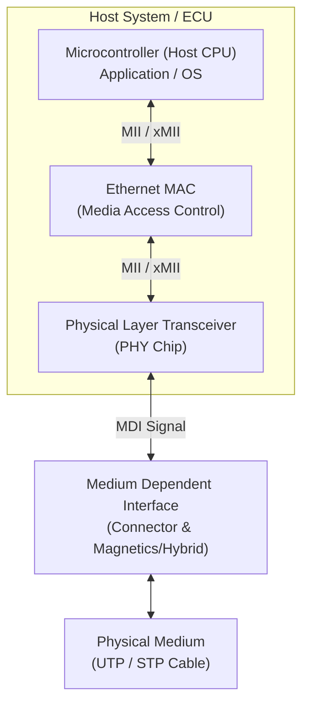

# Physical-Layer

## My Understanding
### Physical Layer Highlights (100BASE-T1)

* **Protocol Origin**: 
  Open Alliance BroadR-Reach (OABR) is the foundational technology for Automotive Ethernet, originally developed by Broadcom. It was later standardized by IEEE as **IEEE 100BASE-T1**.

* **Signal Transmission & Echo Cancellation**:
  * IEEE 100BASE-T1 operates over a single Unshielded Twisted Pair (UTP) cable.
  * To achieve full-duplex communication over a single pair, both nodes send and receive data simultaneously on the same frequency band.
  * **Echo Cancellation**: The receiver subtracts its own transmitted signal voltage from the total voltage on the bus to isolate and decode the pure incoming signal from the sender.
  * **Encoding Scheme**: A combined encoding pipeline of **4B3B, 3B2T, and PAM-3** (Pulse Amplitude Modulation 3-level) is used to translate the bitstream into differential voltage signals.

* **Topologies & Coupling Elements**:
  * IEEE 100BASE-T1 naturally supports point-to-point communication.
  * To enable multi-node communication across a network, active coupling elements such as **Switches** are used to forward frames between different branches.

* **Performance & Duplex Mode**:
  * Supports true **full-duplex** communication (simultaneous bidirectional data transfer).
  * Provides a fixed data rate of **100 Mbps**.

* **Clock Synchronization (Master / Slave)**：
  * To ensure precise signal modulation and cancellation, the PHY clocks of both endpoints must be synchronized.
  * One PHY must be configured as **Master** and the other as **Slave**. The Master PHY generates the continuous clock/synchronization stream, to which the Slave PHY aligns itself.
  * The Master/Slave role is typically configured via the microcontroller's Basic Software (BSW) or PHY register settings.

### Comparison of Ethernet Physical Layer Standards (100BASE-T1 vs 100BASE-TX vs 1000BASE-T)

| Feature / Metric | IEEE 100BASE-T1 | IEEE 100BASE-TX | IEEE 1000BASE-T |
| :--- | :--- | :--- | :--- |
| **Standardization Body / Origin** | IEEE 802.3bw (Based on OPEN Alliance OABR) | IEEE 802.3u (Based on FDDI TP-PMD) | IEEE 802.3ab |
| **Primary Domain / Target Application** | Automotive Ethernet | Traditional IT / Industrial Ethernet | Enterprise / Consumer LAN & Data Centers |
| **Encoding / Decoding** | 4B3B + 3B2T + PAM-3 | 4B5B + NRZI + MLT-3 | 8B1Q4 + Trellis / Viterbi + PAM-5 |
| **Physical Medium** | 1 Unshielded Twisted Pair (2 wires) | 2 Twisted Pairs (4 wires: Cat5 or higher) | 4 Twisted Pairs (8 wires: Cat5e or higher) |
| **Speed & Duplex Mode** | 100 Mbps (Full-Duplex) | 100 Mbps (Half/Full-Duplex via 2 pairs) | 1000 Mbps (Full-Duplex) |
| **Key DSP / Physical Layer Mechanism** | Echo Cancellation & Hybrid circuits | Auto-Negotiation (Fast Link Pulse) | Multi-pair Echo Cancellation & NEXT/FEXT Cancellation |
| **Clock Synchronization (Master/Slave)** | **Required** (Roles configured via BSW/register) | **Not Required** (Asynchronous point-to-point) | **Required** (Roles dynamically negotiated during Auto-Negotiation) |

## Questions
### Q1: What is the architectural structure of the Ethernet Physical Layer? How do components like MCU, MAC, MII, PHY, and MDI connect?

**Answer:**
To understand high-speed Ethernet communications, we need to map out the boundary between the host Microcontroller (MCU) and the physical transmission medium. Here is the standard architecture:

#### Key Components & Terminology

*   **MCU (Microcontroller)**: Executes the high-level software stack (e.g., AUTOSAR TCP/IP, SOME/IP).
*   **MAC (Media Access Control)**: Operates at Layer 2 (Data Link Layer). Handles frame formatting, CRC generation/validation, and MAC addressing.
*   **MII (Media Independent Interface)**: The standardized interface connecting MAC and PHY. Common variants include RMII, RGMII, and SGMII.
*   **PHY (Physical Layer Transceiver)**: Operates at Layer 1. Responsible for line coding, serialization/deserialization (SerDes), clock recovery, and modulation (e.g., PAM-3/PAM-5).
*   **MDI (Medium Dependent Interface)**: The physical connection point (connectors and coupling circuits/hybrids) that bridges the PHY circuitry to the transmission line.
*   **Media**: The underlying physical transmission channel, such as Unshielded Twisted Pair (UTP) or Shielded Twisted Pair (STP) cables.

### Q2: If 100BASE-T1 uses 1 cable pair for 100 Mbps, and 1000BASE-T uses 4 cable pairs, shouldn't the speed of 1000BASE-T be $100\text{ Mbps} \times 4 = 400\text{ Mbps}$? Why is it $1000\text{ Mbps}$?

**Answer:**
The total throughput is not solely determined by multiplying the number of cable pairs. It is the product of three critical physical layer factors:

$$\text{Total Throughput} = (\text{Symbol Rate}) \times (\text{Bits per Symbol}) \times (\text{Number of Parallel Channels})$$

Here is the detailed breakdown comparing both standards:

#### 1. 100BASE-T1 (Automotive Ethernet)
*   **Pairs**: 1 Single Unshielded Twisted Pair (1-pair UTP).
*   **Modulation**: PAM-3 (3 voltage levels: -1, 0, +1).
*   **Bits per Symbol**: 3 bits are mapped to 2 symbols (3B2T encoding), so $1\text{ Symbol} = 1.5\text{ Bits}$.
*   **Symbol Rate**: $66.66\text{ MBaud/s}$.
*   **Throughput Calculation**: 
    $$\text{Speed} = 66.66\text{ MBaud/s} \times 1.5\text{ bits/symbol} = 100\text{ Mbps}$$

#### 2. 1000BASE-T (Gigabit Ethernet)
*   **Pairs**: 4 Twisted Pairs operating simultaneously in Full-Duplex mode.
*   **Modulation**: PAM-5 (5 voltage levels: -2, -1, 0, +1, +2).
*   **Bits per Symbol**: 4 levels represent payload data ($2^2 = 4$), meaning $1\text{ Symbol} = 2\text{ Bits}$ (1 level is reserved for Trellis error correction).
*   **Symbol Rate**: $125\text{ MBaud/s}$ per pair.
*   **Per-Pair Throughput Calculation**:
    $$\text{Speed}_{\text{pair}} = 125\text{ MBaud/s} \times 2\text{ bits/symbol} = 250\text{ Mbps/pair}$$
*   **Total Throughput Calculation**:
    $$\text{Total Speed} = 250\text{ Mbps/pair} \times 4\text{ pairs} = 1000\text{ Mbps } (1\text{ Gbps})$$

#### Summary Comparison Table

| Metric / Parameter | 100BASE-T1 | 1000BASE-T |
| :--- | :--- | :--- |
| **Cable Pairs** | 1 Pair (2 wires) | 4 Pairs (8 wires) |
| **Modulation** | PAM-3 | PAM-5 |
| **Bits per Symbol** | 1.5 bits/symbol | 2.0 bits/symbol |
| **Symbol Rate (Baud Rate)** | 66.66 MBaud/s | 125 MBaud/s per pair |
| **Speed per Pair** | 100 Mbps | 250 Mbps |
| **Total Speed** | **100 Mbps** | **1000 Mbps (1 Gbps)** |

**Conclusion:** 
1000BASE-T reaches $1000\text{ Mbps}$ (1 Gbps) because it upgrades both the **Modulation Efficiency** (PAM-5 instead of PAM-3) and the **Baud Rate** ($125\text{ MBaud/s}$ instead of $66.66\text{ MBaud/s}$) alongside utilizing 4 parallel pairs.

## References

- Vector Introduction to Automotive Ethernet https://certification.vector.com/mod/page/view.php?id=149#maincontent

